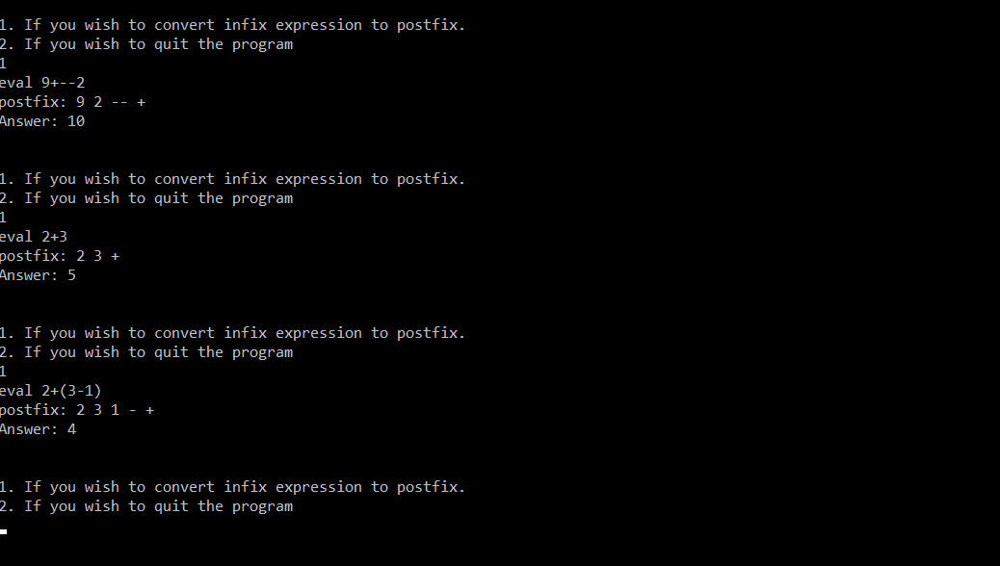

# Arithmetic-Calculator-Postfix-Converter
> Calculator for solving arithmetic expressions and computing Postfix expressions. Feel free to propose improvements and generate pull requests.

## Interface
This is a sample showing multiple arithmetic expressions being solved by the calculator. It supports the basic Binary and unary operations e.g  
* 9+ --2
* 2+(3-1)

## How to Run
* Inside the folder Caluculator, double click the the exe file "Calculator.exe"to directly execute it.

*OR*
* Open "Caluculator.cbp" in CodeBlocks, then build and run it.
* Compile using Visula Studio where it was originally compiled

## Contributions
Your proposed improvements to the repository are most welcome.
* Feel free to fork the repository using the following link <https://github.com/Zaraahmad/Arithmetic-Calculator-Postfix-Converter/fork>
* Commit your changes to the forked repository
* Submit pull request to the [Calculator Repository](https://github.com/Zaraahmad/Arithmetic-Calculator-Postfix-Converter)

Also if you found it useful, please give it a star :D

Have fun playing!

## License
[MIT](../master/LICENSE)

## Author
[**Zara Ahmad**](https://github.com/Zaraahmad)

To stay updated with my GitHub Repositories follow me here on github: 

  
